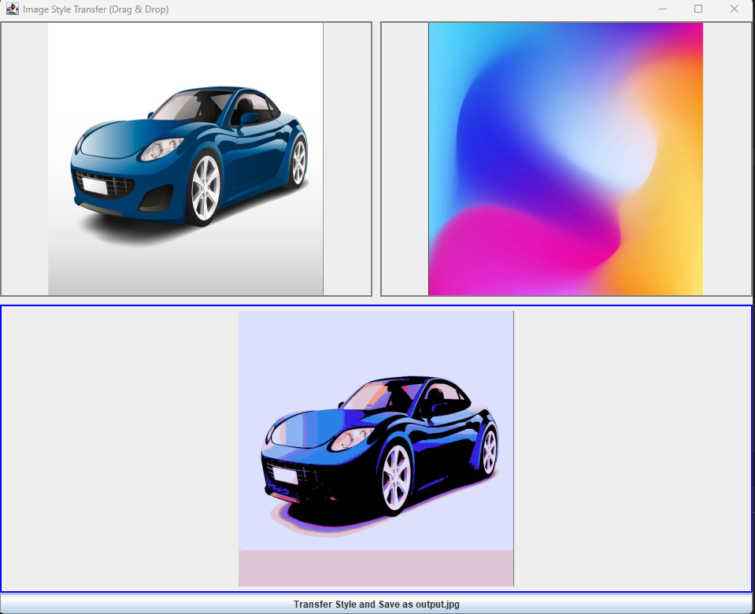

# Java Image-to-Image Style Transfer

This project is a simple image-to-image style transfer tool written in Java, using only the standard library (no external libraries or neural networks). It provides a drag-and-drop Swing UI for selecting two images and applies a color-based style transfer using a palette-matching algorithm.

---

## How It Works

### 1. **User Interface**
- The program opens a window with three image areas:
  - **Content Image**: Drop your main (content) image here.
  - **Style Image**: Drop your style reference image here.
  - **Output Image**: Shows the result after style transfer.
- Click the button to perform style transfer. The output is saved as `output.jpg` and displayed in the UI.

### 2. **Algorithm Overview**
- The style image is reduced to a palette of 32 representative colors using grid sampling.
- For each pixel in the content image, the closest color from the style palette is found (using Euclidean distance in RGB space) and used in the output image.

#### **Mathematical Details**

**Color Distance Formula:**
For two RGB colors `\( (R_1, G_1, B_1) \)` and `\( (R_2, G_2, B_2) \)`, the Euclidean distance is:

`D = \sqrt{(R_1 - R_2)^2 + (G_1 - G_2)^2 + (B_1 - B_2)^2}`

**Palette Construction:**
- The style image is divided into a grid (e.g., 6x6 for 32 colors).
- One color is sampled from the center of each grid cell to form the palette.

**Pixel Mapping:**
- For each pixel in the content image, find the palette color with the smallest distance \( D \) and assign it to the output image at the same position.

---

## How to Run

### **Requirements**
- Java 8 or higher

### **Build and Run**
1. **Compile:**
   ```sh
   javac -d out src/main/java/org/github/aisvoran/Main.java
   ```
2. **Run:**
   ```sh
   java -cp out org.github.aisvoran.Main
   ```

### **Usage**
- Drag and drop your content and style images into the UI.
- Click the button to perform style transfer.
- The result will be saved as `output.jpg` in your working directory and displayed in the UI.

---

## Example

1. **Start the program:**
   ```sh
   java -cp out org.github.aisvoran.Main
   ```
2. **Drag and drop** a photo (e.g., `profile_pic.jpg`) into the left area.
3. **Drag and drop** a style image (e.g., `gradient.jpg`) into the right area.
4. **Click** the transfer button.
5. **View the result** in the lower area and as `output.jpg` in your folder.

---

## Notes & Limitations
- **Performance:** The palette-based approach is much faster than brute-force, but for very large images, processing may still take a few seconds.
- **Image Sizes:** The style image is automatically resized to match the content image.
- **No Neural Networks:** This is a color-matching style transfer, not a deep learning style transfer.
- **Palette Size:** The palette size (32) is a trade-off between speed and style fidelity. You can adjust this in the code if desired.
